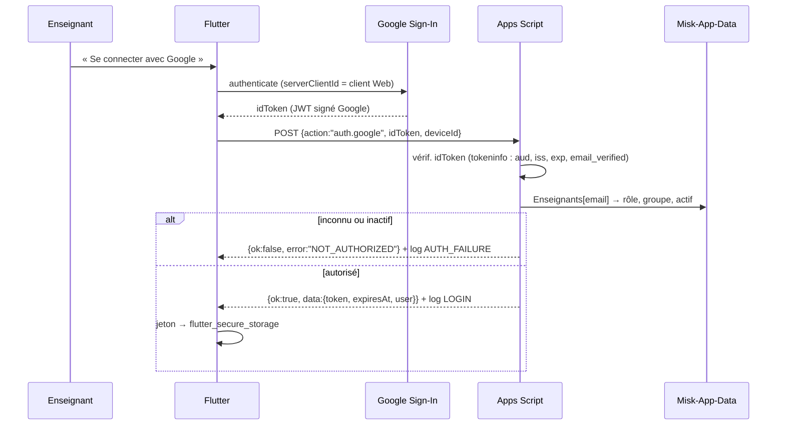
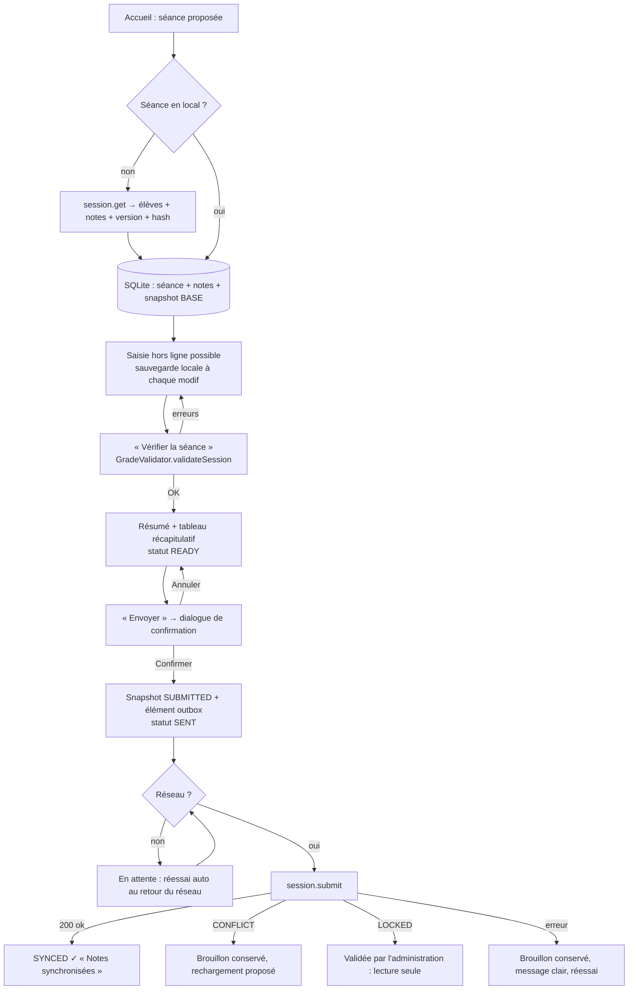
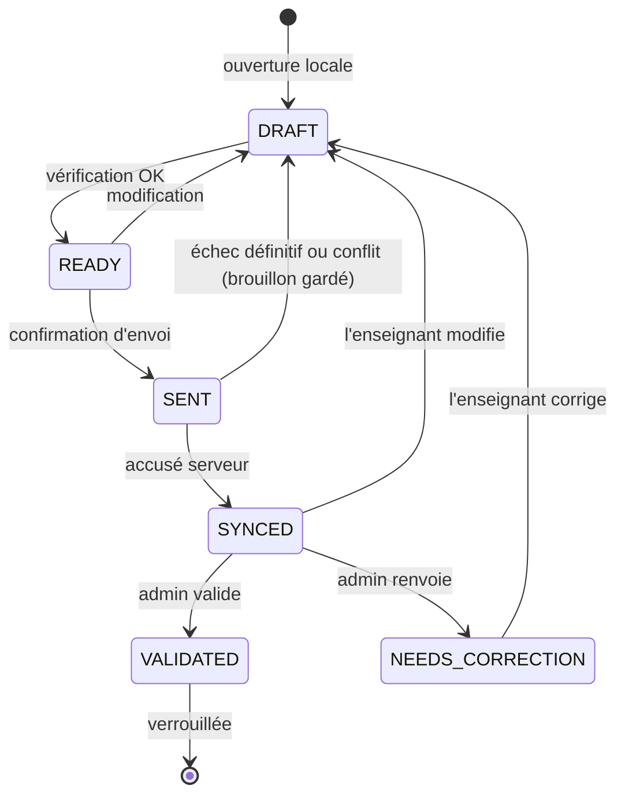

# École Misk — Application enseignants
## Phase 1 : analyse et architecture

> Statut : **validée** (réponses du 2026-10-02 intégrées, voir §13 — elles priment
> sur les sections précédentes en cas de divergence).
> Aucune Google Sheet n'a été modifiée. Les constats ci-dessous proviennent d'une
> lecture seule de `Base-de-donnees` et du classeur du groupe G05 (Rahman-1).
> Aucune donnée personnelle (noms d'élèves, emails de parents, IDs de fichiers)
> n'est reproduite dans ce dépôt.

---

## 0. Constats sur les Google Sheets existantes (lecture seule)

Ces constats modifient plusieurs hypothèses du cahier des charges. Ils sont
placés en tête parce qu'ils conditionnent toute l'architecture.

### 0.1 `Base-de-donnees`

| Onglet | Colonnes | Remarques |
|---|---|---|
| `Eleves` | `ID`, `Nom`, `Nom_Arabic`, `Groupe_ID`, `Nom_Groupe_Arabe`, `Email` | `ID` de type `KEFM02`. **`Email` = emails des parents**, pas des enseignants. |
| `Groupes` | `Groupe_ID`, `Nom_Groupe`, `Nom_Groupe_Arabe`, `Professeur`, `Fichier_ID`, `Nom_Feuille`, `Actif` | IDs `G01`…`G10`. `Professeur` = prénom arabe seulement. `Nom_Feuille` vaut `T1 25-26` ou est **vide**, alors que le classeur G05 contient `T1 26-27` → valeur périmée. |
| `Calendrier` | `Date_Seance` (`JJ-MM-AAAA`), `Annee_Scolaire`, `Trimestre` (`T1`/`T2`/`T3`), `Statut` (`COURS`/`PAS_COURS`), `Commentaire` | Une ligne par dimanche. |
| `Configuration` | `Cle`, `Valeur` (`modeDate`, `dateManuelle`, `modeEnvoi`, `emailTest`) | Un **système existant envoie des emails** (aux parents, vraisemblablement) à partir de ces données. Il ne faut pas le casser. |

**Conséquence majeure :** il n'existe **aucune correspondance email enseignant → groupe**
dans les feuilles actuelles. Il faut ajouter cette donnée quelque part (voir §0.4).

### 0.2 Classeur de groupe (exemple G05)

- Un onglet par trimestre : `T1 26-27`, `T2 25-26`, `T3 25-26`, plus `Moyenne annuelle`.
- Feuille en **sens droite → gauche** : la séance la plus récente est à gauche.

```
Col :   A      B       C      D    | E …     | … | BA     BB      BC     BD   | BE          | BF
L1  :   titre du niveau (fusionné)
L2  :   trimestre (fusionné)
L3  :   SEANCE 14 (fusionné 4 col)   | SEANCE 13 | … | SÉANCE 1 (fusionné)        | اسم التلميذ | رقم التلميذ
L4  :   (date, vide si pas encore faite)            | 2026-09-13                  |             |
L5  :   حضور   إنضباط  أحكام  حفظ   | …       | … | حضور   إنضباط  أحكام  حفظ  |             |
L6+ :   valeurs…                                                                  | nom arabe   | 1, 2, 3…
…   :   ligne « معدل الفصل » (moyennes, formules)
```

Constats précis :

1. **Ordre des sous-colonnes** dans un bloc : `حضور` (Présence), `إنضباط` (Discipline),
   `أحكام` (Tajwid/Ahkam), `حفظ` (Hifz). Ce n'est pas l'ordre Hifz/Tajwid/Disc/Prés.
2. **Les en-têtes de séance sont des numéros**, pas des dates (`SEANCE 14`, `SÉANCE 9`…,
   avec ou sans accent, avec espaces insécables).
3. **La date (ligne 4) n'est remplie que pour les séances déjà faites.**
4. **Décalage calendrier/feuille :** le calendrier indique `COURS` le 06-09-2026, mais
   la feuille commence à `SÉANCE 1 = 2026-09-13`. On ne peut donc **pas** déduire le
   numéro de séance en comptant les dimanches `COURS` du calendrier.
5. **Identifiant élève dans la feuille :** `رقم التلميذ` est un numéro séquentiel (1, 2,
   3…), **pas** l'`ID` de `Eleves` (`KEFM02`). Certaines lignes n'en ont pas.
   Les orthographes arabes diffèrent parfois légèrement entre `Eleves` et la feuille.
6. **Valeur « non évalué » existante :** cellule **vide** dans la majorité des cas,
   mais la valeur texte **`NA`** apparaît aussi.
7. **Des données existantes contredisent les nouvelles règles.** Exemple : présence
   `0` avec des notes de discipline, Ahkam et Hifz renseignées.
8. Sous les élèves : une ligne de moyennes (`معدل الفصل`, formules `#DIV/0!`), puis des
   lignes vides, puis des lignes de test. À droite des blocs : une zone de moyennes
   trimestrielles (formules) et une zone qui semble recopiée d'un autre groupe.
9. Les nombres sont stockés comme valeurs numériques, avec un affichage à virgule
   (locale française).

### 0.3 Ce que cela implique

- Le bloc d'une séance se retrouve **par sa date en ligne 4**. Une nouvelle séance
  s'attribue au **prochain bloc dont la date est vide**. Voir §8.
- L'élève s'identifie par **(numéro de ligne + `رقم التلميذ` + nom normalisé)**,
  revérifiés côté serveur avant toute écriture.
- La valeur `null` (non évalué) s'écrit comme **cellule vide** (recommandé, voir Q2).
- Les **remarques, statuts, versions et logs** n'ont aucune place dans les feuilles
  actuelles. Il faut les stocker ailleurs (voir §0.4).

### 0.4 Données nouvelles nécessaires : proposition (à valider)

Aucune feuille existante n'est modifiée. Je propose **un nouveau classeur séparé**,
`Misk-App-Data`, appartenant au compte administrateur :

| Onglet | Contenu | Pourquoi |
|---|---|---|
| `Enseignants` | `Email`, `Groupe_ID`, `Role` (`TEACHER`/`ADMIN`), `Actif`, `Nom_Affiche` | Absent de `Base-de-donnees` |
| `Seances` | `Groupe_ID`, `Date`, `Onglet`, `Num_Seance`, `Statut`, `Version`, `Hash_Bloc`, `MajPar`, `MajLe`, `ValideePar`, `ValideeLe`, `Commentaire_Correction` | Statuts, version, verrouillage |
| `Remarques` | `Groupe_ID`, `Date`, `Num_Eleve`, `Nom_Eleve`, `Remarque`, `MajLe`, `MajPar` | Aucune colonne de remarque dans les blocs |
| `ConfigGroupes` | `Groupe_ID`, surcharges facultatives (`Onglet_Force`, `Ligne_EnTete`, alias d'en-têtes…) | Gérer les variantes de mise en page |
| `Notifications` | `Email`, `Type`, `Message`, `Groupe_ID`, `Date`, `CreeLe`, `Lu` | Notifications internes V1 |
| `Logs` | colonnes du §29 du cahier des charges | Audit |

Écritures **dans les feuilles existantes**, limitées à :
- les 4 cellules × N élèves du bloc de la séance (valeurs uniquement) ;
- **la cellule de date (ligne 4) du bloc**, si elle est vide, au premier envoi
  (c'est ce qu'un enseignant fait aujourd'hui à la main ; voir Q3).

Les **hash de PIN** et le **secret de signature** vont dans les *Script Properties*
d'Apps Script, jamais dans une feuille.

---

## 1. Architecture finale proposée

```
┌──────────────────────────── Appareil (Android, iOS plus tard) ───────────────────────────┐
│ Flutter                                                                                   │
│  presentation (écrans, widgets responsive téléphone/tablette, FR/AR + RTL)               │
│        │ Riverpod                                                                         │
│  domain (modèles, GradeValidator, SessionSelector, règles de statut)                     │
│        │                                                                                  │
│  data  ├─ Repositories ──► LocalDb (drift/SQLite) : brouillons, snapshots, outbox        │
│        └─ ApiClient (dio) ──► SyncService (outbox, retry, 409)                           │
│  core : AuthService (google_sign_in + PIN), SecureStorage (jeton), Connectivity          │
└───────────────────────────────────────────────┬──────────────────────────────────────────┘
                                                │ HTTPS POST JSON {action, token, params}
                                                ▼
┌────────────────────────── Google Apps Script Web App (exécuté en tant que propriétaire) ─┐
│ doPost/doGet → Router → Middleware (auth, rôle, groupe, LockService)                     │
│   Handlers : auth · me · calendar · sessions · admin · notifications                     │
│   Services : TokenService · PinService · DirectoryService · CalendarService              │
│              SheetLayoutParser · GradeSheetWriter · GradeValidator (miroir) · AuditLog    │
└───────┬───────────────────────────────┬─────────────────────────────────┬────────────────┘
        ▼                               ▼                                 ▼
 Base-de-donnees (lecture)       Classeurs de groupe                Misk-App-Data (nouveau)
 Groupes · Calendrier · Eleves   onglet trimestre : blocs séance    Enseignants · Seances ·
                                 (lecture + écriture valeurs)       Remarques · Logs · …
```

Principes :
- **Flutter ne connaît aucune coordonnée de cellule.** Il manipule `date`, `studentId`
  et les notes. Le serveur résout groupe → classeur → onglet → bloc → lignes.
- **Le serveur ne fait jamais confiance au client.** Le groupe d'un enseignant vient
  de son jeton et de `Enseignants`. Un `groupId` envoyé par Flutter n'est qu'un contrôle
  de cohérence.
- **Le local est la source de vérité de la saisie en cours.** Le serveur est la source
  de vérité de ce qui a été envoyé.
- **Les règles métier existent en deux exemplaires** (Dart et JS), testés avec les
  mêmes cas (fixtures JSON partagées dans `shared/fixtures/`).

---

## 2. Diagrammes des flux

### 2.1 Authentification



Variante PIN : `auth.pin {email, pin}`. Contrôles : verrouillage anti brute-force,
puis `HMAC(pepper, sel ‖ pin)` itéré, comparé au hash stocké. Voir §7.

### 2.2 Saisie, vérification, envoi



### 2.3 Cycle de vie d'une séance



`DRAFT`, `READY` et `SENT` sont des états **locaux**. `SYNCED`, `NEEDS_CORRECTION` et
`VALIDATED` sont des états **serveur**. Une séance porte les deux (`localStatus`,
`serverStatus`). Exemple affiché : « Synchronisée · 3 modifications non envoyées ».

---

## 3. Packages Flutter

Versions exactes fixées en Phase 2 (dernières versions stables à cette date).

| Package | Rôle | Pourquoi nécessaire |
|---|---|---|
| `flutter_riverpod` | état + injection de dépendances | Testable sans BuildContext, overrides simples pour les mocks, pas de codegen obligatoire |
| `go_router` | navigation | Redirections déclaratives (non connecté → login, admin → dashboard), deep links |
| `drift` + `sqlite3_flutter_libs` | base locale SQLite typée | Transactions, migrations versionnées, requêtes réactives (streams) pour « Enregistré localement ✓ » |
| `path_provider` | emplacement du fichier SQLite | Requis par drift |
| `dio` | client HTTP | Timeouts, intercepteurs (jeton, logs), gestion manuelle de la redirection 302 d'Apps Script |
| `google_sign_in` | Sign in with Google | Obtenir l'`idToken` vérifié côté serveur |
| `flutter_secure_storage` | stockage du jeton | Android Keystore / iOS Keychain |
| `connectivity_plus` | indice de connectivité | Déclencher les réessais. Seul le succès HTTP fait foi. |
| `intl` + `flutter_localizations` (SDK) | i18n FR/AR, dates, RTL | ARB + `gen-l10n` |
| `uuid` | identifiants locaux | IDs de snapshot, clés d'idempotence, `deviceId` |

Dev : `flutter_lints`, `build_runner` + `drift_dev` (codegen drift), `mocktail` (mocks).

Écartés volontairement :
- `freezed` / `json_serializable` : modèles écrits à la main. On garde ainsi le contrôle
  total de la sémantique `null` ≠ `0` et on évite une seconde chaîne de codegen.
- Firebase : aucune justification en V1.
- `workmanager` (synchro en arrière-plan) : l'envoi exige une confirmation explicite.
  Les réessais se font quand l'application est ouverte. À reconsidérer en V2.
- `sqlcipher` : chiffrement de la base. Option V2 (voir risque R17).

---

## 4. Modèles de données (domaine Dart)

```dart
enum UserRole { teacher, admin }

sealed class AppUser { String email; String displayName; UserRole role; }
class Teacher extends AppUser { String groupId; }
class AdminUser extends AppUser {}

class Group {
  String groupId;        // "G05"
  String nameFr;         // "Rahman-1"
  String nameAr;         // "الرحمن 1"
  String teacherName;    // "Professeur"
  bool active;
}

enum CalendarDayStatus { cours, pasCours }
class SchoolSession {   // entrée de calendrier
  DateOnly date;         // type date sans heure ni fuseau
  String schoolYear;     // "2026-2027"
  String term;           // "T1"
  CalendarDayStatus status;
  String? comment;
}

class Student {
  String studentId;      // "num:7", ou "row:23" si رقم التلميذ absent
  String displayName;    // tel que lu dans la feuille
  int order;             // ordre de la feuille, jamais trié
}

enum Attendance { present, absent /* V2 : excusedAbsent, late… */ }
// sérialisation V1 : present ↔ 10, absent ↔ 0

class StudentGrade {
  String studentId;
  String studentName;
  int order;
  double? hifz;          // null = non évalué (« -- »)
  double? tajwid;
  double? discipline;
  Attendance attendance; // obligatoire, défaut : absent
  String? remark;
}

enum SessionStatus { draft, ready, sent, synced, needsCorrection, validated }

class SessionGrades {
  String groupId;
  DateOnly sessionDate;
  int? sessionNumber;    // n° de bloc « SÉANCE n », informatif
  SessionStatus localStatus;
  SessionStatus? serverStatus;
  int serverVersion;     // 0 = jamais envoyée
  String? baseHash;      // hash du bloc au téléchargement
  List<StudentGrade> grades;
  String? correctionComment;
  DateTime updatedAt;
}

class SyncState { int pendingChanges; DateTime? lastSyncAt; AppError? lastError; bool inFlight; }
class AuditEntry { DateTime at; String action; String status; String? details; int? versionBefore; int? versionAfter; }
class AppNotification { String id; String type; String message; DateOnly? sessionDate; bool read; }
```

`GradeValidator` (domaine, fonctions pures, partagé par tous les écrans) :
- `isValidQuarterGrade(double v)` : `0 ≤ v ≤ 10` et `v*4` entier (tolérance flottante 1e-9) ;
- `validatePresence(int raw)` : `raw ∈ {0, 10}` ;
- `requiresDisciplineRemark(g)` : `g.discipline != null && g.discipline! < 7` ;
- `validateAbsentStudent(g)` : absent ⇒ hifz, tajwid et discipline à `null` ;
- `normalize(g)` : applique automatiquement la règle d'absence (remet à `null`) ;
- `validateSessionBeforeSubmit(s)` : renvoie `List<ValidationIssue>` (élève, champ,
  code, sévérité `error`/`warning`). Exemples d'avertissements : « 2 notes non évaluées ».

---

## 5. Base locale (SQLite / drift)

```
sessions_local
  id TEXT PK (uuid)                    group_id TEXT          session_date TEXT (YYYY-MM-DD)
  session_number INT NULL              local_status TEXT      server_status TEXT NULL
  server_version INT DEFAULT 0         base_hash TEXT NULL    correction_comment TEXT NULL
  created_at, updated_at, synchronized_at, last_sync_error TEXT NULL
  UNIQUE(group_id, session_date)

student_grades_local
  session_id FK → sessions_local.id    student_id TEXT        student_name TEXT
  sort_order INT                       hifz REAL NULL         tajwid REAL NULL
  discipline REAL NULL                 attendance TEXT        remark TEXT NULL
  dirty INT (0/1)                      updated_at
  PK(session_id, student_id)

snapshots
  id TEXT PK                           session_id FK          kind TEXT  -- BASE | SUBMITTED | CONFLICT_LOCAL
  payload_json TEXT                    payload_hash TEXT      server_version_at INT
  created_at                           result TEXT NULL       -- OK | CONFLICT | ERROR:<code>

outbox
  id TEXT PK                           session_id FK          snapshot_id FK
  idempotency_key TEXT UNIQUE          state TEXT             -- PENDING | IN_FLIGHT | DONE | FAILED | CONFLICT
  attempts INT                         next_attempt_at        last_error TEXT NULL     created_at

calendar_cache   (date PK, school_year, term, status, comment, fetched_at)
notifications    (id PK, type, message, session_date, read, created_at)
kv               (key PK, value)  -- locale, deviceId, profil en cache, dernière synchro
```

Règles :
- Chaque modification d'une note est une **transaction** (`update` + `dirty=1` + `updated_at`).
  Aucun bouton « Enregistrer » n'est nécessaire.
- Le snapshot `BASE` est l'état serveur téléchargé. Il permet le diff « Hifz : 8 → 8.5 »
  et le compteur « 3 modifications non synchronisées ».
- Le snapshot `SUBMITTED` est figé au moment de la confirmation. C'est **lui** qui est
  envoyé et réessayé, jamais l'état mutable.
- Un échec HTTP ne supprime jamais rien. Seul un accusé `ok` passe l'outbox en `DONE`,
  remet `dirty=0` et remplace `BASE`.
- Déconnexion : la base est effacée **seulement si l'outbox est vide**. Sinon un
  avertissement explicite s'affiche.

---

## 6. API Apps Script

### 6.1 Contraintes de la plateforme (déterminantes)

1. Une Web App Apps Script **ne peut pas renvoyer de code HTTP personnalisé** : toujours
   `200`. Le statut métier passe donc dans une enveloppe JSON (`error.httpStatus: 409`).
2. `doPost(e)` **n'expose pas les en-têtes HTTP** (`Authorization` illisible). Le jeton
   passe dans le **corps JSON**.
3. Une requête POST reçoit un **302** vers `script.googleusercontent.com`. Le client doit
   suivre ce lien en **GET**. Dart ne le fait pas automatiquement pour un POST, d'où une
   gestion explicite dans `ApiClient`.
4. Déploiement : *Exécuter en tant que : moi (propriétaire)*, *Accès : tout le monde*.
   L'autorisation est entièrement applicative (jeton).

Conséquence : **un seul point d'entrée, toujours en POST** (même pour les lectures), ce
qui évite aussi les jetons dans les URL et les caches.

### 6.2 Enveloppes

```json
// requête
{ "action": "session.submit", "token": "…", "requestId": "uuid", "appVersion": "1.0.0",
  "deviceId": "uuid", "params": { … } }

// réponse
{ "ok": true,  "data": { … }, "serverTime": "2026-10-02T14:03:00Z" }
{ "ok": false, "error": { "code": "CONFLICT", "httpStatus": 409,
                          "message": "La séance a été modifiée depuis votre téléchargement.",
                          "details": { "serverVersion": 4 } } }
```

Codes d'erreur : `BAD_REQUEST`, `AUTH_REQUIRED`, `AUTH_EXPIRED`, `NOT_AUTHORIZED`,
`FORBIDDEN_GROUP`, `RATE_LIMITED`, `GROUP_NOT_FOUND`, `SPREADSHEET_NOT_FOUND`,
`SHEET_TAB_NOT_FOUND`, `SESSION_NOT_FOUND`, `SESSION_NOT_A_CLASS_DAY`,
`STUDENT_NOT_FOUND`, `STUDENT_MISMATCH`, `SHEET_STRUCTURE_INVALID`, `VALIDATION_FAILED`,
`SESSION_LOCKED`, `CONFLICT`, `LOCK_TIMEOUT`, `INTERNAL`.

### 6.3 Actions (correspondance avec les routes REST suggérées)

| Route logique | `action` | Rôle | Description |
|---|---|---|---|
| `POST /auth/google` | `auth.google` | public | `idToken` → jeton |
| `POST /auth/pin` | `auth.pin` | public | `email`, `pin` → jeton |
| — | `auth.logout` | tous | Révoque les jetons de l'appareil |
| `GET /me` | `me.get` | tous | Profil, groupe, rôle |
| `GET /sessions` | `sessions.list` | enseignant | Dates `COURS` de l'année + statut serveur + séance proposée |
| `GET /sessions/{date}` + `/students` + `/grades` | `session.get` | enseignant | **Un seul appel :** élèves (ordre feuille), notes, remarques, statut, version, `baseHash` |
| `POST /sessions/{date}/submit`, `PUT …/grades` | `session.submit` | enseignant | Création ou mise à jour (`baseVersion` = 0 ou n) |
| `GET /admin/dashboard` | `admin.dashboard` | admin | Groupes × statut pour une date |
| `GET /admin/sessions/{g}/{date}` | `admin.session.get` | admin | Lecture seule + compteurs |
| `POST /admin/sessions/{date}/validate` | `admin.session.validate` | admin | `expectedVersion` → `VALIDATED` |
| `POST …/request-correction` | `admin.session.requestCorrection` | admin | `comment` obligatoire |
| — | `notifications.list` | tous | Notifications internes depuis une date |

La gestion des PIN (création, réinitialisation) **ne passe pas par l'API**. Ce sont des
fonctions lancées depuis l'éditeur Apps Script par l'administrateur, ce qui réduit la
surface d'attaque.

### 6.4 Organisation du code Apps Script

```
apps_script/
  Main.gs            doGet (santé/version), doPost → Router
  Router.gs          table action → {handler, roles, needsLock}
  Http.gs            parse, enveloppes, mapping exception → code
  Config.gs          Script Properties (IDs classeurs, secrets, client Google), constantes
  Auth/TokenService.gs, Auth/GoogleAuth.gs, Auth/PinService.gs, Auth/RateLimiter.gs
  Directory.gs       Enseignants, Groupes (cache 5 min via CacheService)
  Calendar.gs        lecture/normalisation dates, séance proposée
  Sheets/LayoutParser.gs   findHeaderRow, findSessionBlocks, findSessionBlockByDate, findStudentRows
  Sheets/GradeReader.gs    lecture d'un bloc → DTO
  Sheets/GradeWriter.gs    préparation + écriture du bloc, vérification relecture
  Domain/GradeValidator.gs miroir des règles Dart
  Meta/SessionsRepo.gs, Meta/RemarksRepo.gs, Meta/NotificationsRepo.gs
  Audit/AuditLog.gs
  Admin/PinAdmin.gs  fonctions manuelles (setPin, resetLockout)
  Tests/*.gs         tests du parser sur des tableaux en mémoire + dry-run sur les vrais classeurs (lecture seule)
```

Développement local avec **clasp** (versionné dans ce dépôt). Les secrets restent dans
les Script Properties, jamais dans le dépôt.

---

## 7. Authentification

### 7.1 Google
- Flutter : `google_sign_in` avec `serverClientId` = **ID client OAuth « Web »** du
  projet Google Cloud (nécessaire pour obtenir un `idToken`), plus un client Android
  (empreinte SHA-1 de signature). Scopes : `openid email profile` uniquement.
- Serveur : `UrlFetchApp` → `oauth2.googleapis.com/tokeninfo?id_token=…`. Contrôles :
  `aud` = notre client Web, `iss` ∈ {`accounts.google.com`, `https://accounts.google.com`},
  `exp` futur, `email_verified = true`. Ensuite, recherche de l'email (minuscules,
  sans espaces) dans `Enseignants`.

### 7.2 Email + PIN (5 chiffres)
- Stockage : Script Property `pin:<email>` = `{salt, iter, hash}`, avec
  `hash = HMAC-SHA256` itéré (≈ 2 000 tours) de `salt ‖ pin`, clé = `PIN_PEPPER`
  (Script Property). Sans le pepper, une fuite des hash ne permet pas de retrouver les
  100 000 PIN possibles hors ligne.
- Anti brute-force (`CacheService` + `PropertiesService`) :
  5 échecs → blocage 15 min. Au-delà, blocage croissant (1 h, 24 h), puis déblocage
  manuel par l'admin. Un plafond global par appareil (`deviceId`) limite aussi les
  tentatives sur plusieurs emails. Les échecs sont journalisés (`AUTH_FAILURE`) et une
  alerte `SUSPICIOUS` est levée au-delà d'un seuil.
- Comparaison en temps constant. Le message d'erreur reste générique (« Email ou PIN
  incorrect ») pour ne pas révéler les emails existants.
- « PIN unique à l'enseignant » = PIN personnel, non partagé (voir Q7).

### 7.3 Jeton applicatif
- Format : `base64url(payload).base64url(HMAC-SHA256(TOKEN_SECRET, payload))` avec
  `payload = {sub: email, role, iat, exp, epoch, dev}`.
- Durée : **30 jours**, adaptée à l'usage hebdomadaire et au hors ligne. Révocation :
  `epoch` par utilisateur (Script Property). L'incrémenter invalide tous ses jetons.
- **À chaque requête**, le serveur revérifie : signature, expiration, epoch, puis
  relit `Enseignants` (en cache 5 min) pour le rôle, le groupe et le flag actif. Le
  jeton ne fait donc **jamais** autorité seul sur le groupe.
- Jeton expiré hors ligne : la saisie et l'outbox restent intactes. À l'envoi, l'app
  demande une reconnexion puis reprend l'outbox.

---

## 8. Stratégie de lecture des Google Sheets

### 8.1 Résolution groupe → onglet
1. `Groupes[groupId]` → `Fichier_ID`, `Actif` (sinon `GROUP_NOT_FOUND`).
2. `Calendrier[date]` → `Trimestre`, `Annee_Scolaire` (sinon `SESSION_NOT_FOUND`).
   Statut `PAS_COURS` → `SESSION_NOT_A_CLASS_DAY`.
3. Nom d'onglet attendu : `"<Trimestre> <aa>-<aa>"`, par ex. `T1 26-27` pour
   `T1` + `2026-2027`.
   Ordre de priorité : `ConfigGroupes.Onglet_Force` → nom calculé →
   `Groupes.Nom_Feuille` → sinon `SHEET_TAB_NOT_FOUND`. Comparaison normalisée
   (espaces, espaces insécables, casse).

### 8.2 Analyse de la mise en page (`LayoutParser`, une seule lecture `getValues()` + `getFormulas()`)
1. **Ligne d'en-tête de séance** : la première des 10 premières lignes qui contient
   ≥ 1 cellule correspondant à `/^\s*S[EÉ]ANCE\s*(\d+)\s*$/i` (après normalisation NFC
   et suppression des espaces insécables).
2. **Blocs** : chaque cellule correspondante donne `{numéro, colDébut}`. Le bloc couvre
   4 colonnes.
3. **Sous-en-têtes** (ligne en-tête + 2) : dans chaque bloc, chaque colonne est associée
   par alias :
   - présence : `حضور`, `Présence`, `Presence`
   - discipline : `إنضباط`, `انضباط`, `Discipline`
   - tajwid : `أحكام`, `احكام`, `Tajwid`, `Ahkam`
   - hifz : `حفظ`, `Hifz`
   
   Normalisation arabe : suppression des tashkeel et du tatweel, `أ/إ/آ → ا`.
   **Aucune position fixe** : l'ordre est lu, pas supposé.
4. **Ligne de date** (ligne en-tête + 1) : valeur `Date` ou texte (`AAAA-MM-JJ` ou
   `JJ-MM-AAAA`) normalisée en `YYYY-MM-DD` dans le fuseau du script
   (`America/Toronto`).
5. **Colonnes élève** : `اسم التلميذ` (nom) et `رقم التلميذ` (numéro), trouvées sur la
   ligne d'en-tête, **la paire la plus proche à droite du bloc `SÉANCE 1`**. Cela exclut
   les zones de moyennes situées plus à droite.
6. **Lignes élèves** : à partir de la ligne sous-en-têtes + 1, jusqu'à la première ligne
   dont le nom est vide **ou** commence par `معدل` (ligne de moyennes) **ou** contient
   une formule dans la colonne du nom. Tout ce qui suit (lignes de test) est ignoré.
7. Contrôles d'intégrité → `SHEET_STRUCTURE_INVALID`, avec un détail technique journalisé :
   numéros de séance dupliqués, bloc incomplet, sous-en-tête manquant, colonne nom
   introuvable, ou **cellule cible contenant une formule** (jamais écrasée).

### 8.3 `findSessionBlockByDate(layout, date, calendar)`
1. Un bloc dont la date (ligne 4) = `date` → ce bloc.
2. Sinon (nouvelle séance), soit `B` le bloc daté le plus récent (numéro max). On
   retient `B+1` **si** sa date est vide, que `date > date(B)` et qu'**aucun** dimanche
   `COURS` du calendrier ne se trouve strictement entre `date(B)` et `date`. Cela empêche
   de « sauter » une séance non saisie.
   Si aucun bloc n'est daté, on retient `SÉANCE 1` seulement si `date` est le premier
   `COURS` du trimestre **ou** si `ConfigGroupes` le précise. Ce cas couvre le décalage
   observé au 06-09-2026.
3. Sinon → `SESSION_NOT_FOUND`, avec un message clair (« Le bloc de cette séance n'existe
   pas encore dans la feuille du groupe ; contactez l'administration »).
4. À l'écriture d'une nouvelle séance, la date est inscrite dans la cellule (ligne 4)
   du bloc, si Q3 est validée. Le lien date ↔ bloc devient alors permanent.

### 8.4 `findStudentRow(layout, studentId, studentName)`
- `studentId` = `num:<رقم التلميذ>`, ou `row:<n>` si le numéro est absent.
- Le serveur vérifie que la ligne attendue porte toujours le même numéro **et** le même
  nom normalisé. Sinon, il cherche par numéro puis par nom. Aucune correspondance ou
  plusieurs correspondances → `STUDENT_MISMATCH` : rien n'est écrit, et l'app propose de
  recharger la séance.

### 8.5 Lecture des valeurs
- Nombre → `double`. Vide, `NA`, `--`, `-` → `null`. Présence : `10` → présent, `0` →
  absent, autre valeur → `null`, signalé comme anomalie à l'enseignant (présence
  obligatoire à l'envoi).
- **Les données existantes non conformes** (absent avec notes, notes hors pas de 0.25)
  sont affichées telles quelles avec un avertissement, sans blocage à la lecture. Les
  règles s'appliquent **à l'envoi**.

### 8.6 Élèves des anciennes séances
La liste vient **toujours de la feuille** (onglet du trimestre) dans son ordre. Un
élève sans aucune valeur dans un bloc passé est affiché « -- ». Il n'existe pas de
notion de date d'entrée ou de sortie dans les feuilles, donc la V1 ne peut pas faire
mieux sans donnée supplémentaire (voir R9).

### 8.7 Fonctions de test côté Apps Script
- `test_parseLayout_fixtureG05()` : tableaux en mémoire reproduisant la structure
  observée (anonymisée).
- `dryRun_allGroups()` : **lecture seule** de chaque classeur actif. Rapport par groupe :
  onglet trouvé, blocs, dates, nombre d'élèves, anomalies. À exécuter avant toute mise
  en service, pour détecter les groupes à configurer (G04, G07 et G08 ont `Nom_Feuille`
  vide).

---

## 9. Synchronisation hors ligne

1. **Téléchargement** (`session.get`) : séance + élèves + notes + remarques + `version` +
   `baseHash`, enregistrés en local avec un snapshot `BASE`. Préchargement facultatif
   des 4 dernières séances au lancement (Wi-Fi).
2. **Saisie** : uniquement en local, à chaque modification, en transaction. Aucun appel
   réseau.
3. **Vérification** : `validateSessionBeforeSubmit` → résumé (élèves, présents, absents,
   non évalués, remarques) + tableau. Statut `READY`.
4. **Confirmation** → snapshot `SUBMITTED` (JSON canonique + hash) + élément `outbox` avec
   `idempotencyKey`. Statut `SENT`.
5. **Envoi** (`SyncService`, tâche unique) : immédiat si le réseau est disponible.
   Sinon réessai au retour du réseau, à la reprise de l'app, ou manuellement (écran
   Synchronisation). Délais de réessai : 5 s, 30 s, 2 min, 10 min (plafond), uniquement
   pour les erreurs transitoires (réseau, timeout, `LOCK_TIMEOUT`, `INTERNAL`).
6. **Côté serveur** (`session.submit`) :
   1. jeton → utilisateur → rôle `TEACHER` → groupe (pas celui du client) ;
   2. validation complète du payload (types, doublons, règles métier) ;
   3. `LockService.getScriptLock().waitLock(20000)` ;
   4. `Seances[g,date].Statut == VALIDATED` → `SESSION_LOCKED` ;
   5. lecture du bloc → `currentHash` ;
   6. **idempotence** : si `currentHash == hash(payload)` et la clé est déjà connue,
      on renvoie le succès précédent (cas « l'écriture a réussi mais la réponse s'est
      perdue ») ;
   7. **conflit** : `baseVersion != Seances.Version` **ou** `baseHash != currentHash`
      (modification manuelle dans la feuille) → `CONFLICT` 409, avec les valeurs
      actuelles ;
   8. construction d'un tableau 2D couvrant **tout le bloc** (lignes contiguës des
      élèves × 4 colonnes, dans l'ordre lu au §8.2.3). Les élèves absents du payload
      gardent leur valeur actuelle. Écriture en **un seul `setValues`**, puis la date
      ligne 4 si nécessaire, puis `SpreadsheetApp.flush()` ;
   9. relecture et comparaison. En cas d'écart, restauration de l'ancien tableau (gardé
      en mémoire) et `INTERNAL` ;
   10. mise à jour de `Seances` (version+1, `SYNCED`, hash, auteur), `Remarques` (upsert),
       `Logs` (diff par champ : `Hifz : 8 → 8.5`) ;
   11. libération du verrou → `{version, hash, status}`.
7. **Réponse côté app** : `ok` → `SYNCED`, `BASE` ← `SUBMITTED`, `dirty=0`, notification
   « ✓ Notes synchronisées ».
   `CONFLICT` → le brouillon est conservé dans un snapshot `CONFLICT_LOCAL`. L'app affiche
   l'écart (serveur ↔ mes valeurs) et propose « Recharger la séance ». Les valeurs
   locales restent consultables pour être ressaisies. Il n'y a **jamais** d'écrasement
   silencieux.
   `SESSION_LOCKED` → lecture seule + message du §16.
8. **Rafraîchissement des statuts** (`sessions.list`, `notifications.list`) à chaque
   ouverture de l'app en ligne : détecte `VALIDATED` / `NEEDS_CORRECTION`.

Atomicité : Apps Script n'offre pas de transaction multi-classeurs. On l'approche par un
seul `setValues` par bloc (la seule écriture dans les feuilles existantes), une
vérification par relecture avec restauration, des métadonnées écrites **après** les
notes, et l'idempotence qui rattrape un état « notes écrites, méta pas encore » au
réessai suivant.

---

## 10. Principaux risques techniques

| # | Risque | Impact | Mitigation |
|---|---|---|---|
| R1 | Pas de code HTTP ni d'en-têtes dans une Web App Apps Script | Conception API | Enveloppe JSON, jeton dans le corps, POST unique |
| R2 | Redirection 302 sur les POST | Appels en échec | Redirection gérée explicitement dans `ApiClient`, testée |
| R3 | Latence Apps Script (1 à 5 s, démarrage à froid) et quotas (6 min/exécution, 30 exécutions simultanées, 20 k UrlFetch/jour) | UX | Un appel par écran, cache serveur (`CacheService`), indicateurs de chargement, hors ligne par défaut |
| R4 | **Pas de date pour les futures séances dans les feuilles + décalage calendrier/feuille** (06-09) | Mauvais bloc écrit | Résolution par date ligne 4, règle stricte du « prochain bloc vide », refus en cas de doute, `dryRun_allGroups` |
| R5 | Mises en page différentes selon les groupes/onglets (lignes de titre, accents, espaces insécables, onglets périmés) | Erreurs de lecture | Parser par motifs + alias, `ConfigGroupes`, contrôles d'intégrité, rapport de dry-run |
| R6 | Pas d'identifiant élève stable (numéro séquentiel, parfois absent ; orthographes divergentes avec `Eleves`) | Écriture sur le mauvais élève | Triple vérification ligne + numéro + nom, refus si ambigu |
| R7 | Données existantes non conformes (absent avec notes, `NA`) | Blocages ou surprises | Lecture tolérante + avertissements, règles appliquées à l'envoi |
| R8 | Représentation du « non évalué » (vide / `NA` / `--`) et formules de moyenne | Moyennes fausses ou `#VALUE!` | Écrire une **cellule vide** (cohérent avec les formules `AVERAGE`), voir Q2 |
| R9 | Appartenance historique des élèves non modélisée | Élève affiché à tort dans une séance passée | Liste par onglet de trimestre. Amélioration possible avec une donnée future. |
| R10 | Modifications manuelles concurrentes dans Google Sheets | Écrasement | `baseHash` du bloc + version → `CONFLICT` |
| R11 | Déclencheurs `onEdit` existants ou script d'envoi d'emails | Comportement existant non déclenché ou perturbé | Les écritures par script ne déclenchent pas `onEdit` simple. **Inventorier les scripts existants** avant la Phase 3. |
| R12 | Écriture sur des formules / plages protégées / cellules fusionnées | Casse de la feuille | `getFormulas()` sur la cible → refus. Écriture valeurs uniquement, jamais de formatage. |
| R13 | Aucun mapping enseignant ↔ email existant | Bloquant pour l'auth | Onglet `Enseignants` dans `Misk-App-Data` (Q1) |
| R14 | Configuration Google Cloud (clients OAuth Web + Android, SHA-1 debug/release, écran de consentement) | Sign-In impossible | Checklist en Phase 4. Le PIN sert de solution de repli. |
| R15 | PIN à 5 chiffres = faible entropie | Accès illégitime | Rate-limit strict, pepper, logs, révocation par epoch |
| R16 | Fuseaux et formats de date (texte `JJ-MM-AAAA` vs `Date`) | Mauvaise séance | Type `DateOnly`, chaînes `YYYY-MM-DD` dans l'API, fuseau script fixé |
| R17 | Données de mineurs sur l'appareil (contexte québécois : Loi 25) | Confidentialité | Données minimales, effacement à la déconnexion, verrouillage de l'appareil recommandé, chiffrement SQLite en option V2 |
| R18 | Verrou global `LockService` | Attente si envois simultanés | ~10 groupes, écriture < 2 s → acceptable. `LOCK_TIMEOUT` réessayable. |
| R19 | Versions de déploiement Apps Script | Client cassé après mise à jour | Déploiement à URL fixe (« modifier le déploiement »), `appVersion` dans les requêtes, version d'API dans `doGet` |
| R20 | Saisie décimale (virgule/point selon la locale) | Notes refusées | Le champ accepte `,` et `.`, normalisation dans `GradeValidator` |

---

## 11. Structure du dépôt (Phase 2+)

```
app/                       projet Flutter
  lib/
    main.dart, app.dart
    core/ api/ auth/ database/ errors/ localization/ theme/ utils/ sync/
    features/
      auth/        data/ domain/ presentation/
      dashboard/   presentation/
      sessions/    data/ domain/ presentation/
      grades/      domain/(grade_validator.dart) presentation/(phone_list, tablet_table, student_sheet)
      admin/       data/ presentation/
      settings/    presentation/
    l10n/ app_fr.arb, app_ar.arb
  test/
apps_script/               projet clasp (§6.4)
shared/fixtures/           cas de test JSON communs Dart + JS (règles de notes, mock 5 élèves)
docs/
```

Données mock (Phase 2) : groupe `G05 / Rahman-1`, enseignant `teacher@example.com`,
séance **2026-09-27**. Le 2026-09-28 du cahier des charges est un lundi, alors que
2026-09-27 est un dimanche `COURS` du calendrier réel. 5 élèves fictifs (noms FR/AR) :
présent complet, absent, non évalué, discipline 6.5 avec remarque, discipline 5 sans
remarque.

---

## 12. Questions à valider avant la Phase 2

1. **Q1 – Stockage des nouvelles données** : accepter un nouveau classeur
   `Misk-App-Data` (recommandé, aucun impact sur l'existant), ou préférer de nouveaux
   onglets dans `Base-de-donnees` ?
2. **Q2 – « Non évalué » dans les feuilles** : écrire une **cellule vide** (recommandé,
   cohérent avec l'existant et les formules), `NA` ou `--` ?
3. **Q3 – Date de la séance** : l'API peut-elle inscrire la date dans la ligne 4 du
   bloc lors du premier envoi (ce que les enseignants font aujourd'hui à la main) ?
4. **Q4 – Remarques** : uniquement dans `Misk-App-Data`, ou aussi en *note de cellule*
   Google Sheets sur la case Discipline (visible dans la feuille, sans changer les
   valeurs) ?
5. **Q5 – Administrateurs** : quels emails ont le rôle ADMIN ?
6. **Q6 – Séance du 06-09-2026** : confirmer qu'elle n'a pas eu lieu pour les groupes, et
   que la date en ligne 4 fait foi (plutôt que le comptage du calendrier).
7. **Q7 – PIN** : « unique à l'enseignant » = personnel (recommandé), ou faut-il
   interdire que deux enseignants aient le même PIN ?
8. **Q8 – Scripts existants** : quels scripts lisent ou écrivent les classeurs de groupe
   (envoi d'emails via `Configuration`, calcul de moyennes) ? Je voudrais les connaître
   avant d'écrire quoi que ce soit (R11).
9. **Q9 – Un enseignant = un groupe** : y a-t-il des remplaçants, ou un enseignant
   susceptible d'avoir deux groupes plus tard ? Le modèle `Enseignants` le permettrait
   sans refonte.

---

## 13. Décisions validées (2026-10-02)

| # | Décision | Conséquence sur l'architecture |
|---|---|---|
| Q1 | Nouvel onglet **`Enseignants`** dans `Base-de-donnees`, lié à `Groupes` | Colonnes : `Email`, `Nom`, `Groupe_ID` (= `Groupes.Groupe_ID`, liste déroulante conseillée), `Role` (`TEACHER`/`ADMIN`), `Actif`. Le serveur refuse un email en double ou un `Groupe_ID` inconnu de `Groupes`. Le classeur `Misk-App-Data` n'est **pas** créé. |
| Q1' | Données techniques restantes (statuts/versions, logs, notifications) | **Proposition** : onglets préfixés `App_` dans `Base-de-donnees` (`App_Seances`, `App_Logs`, `App_Notifications`), créés par une fonction `setup()` lancée **manuellement** par l'admin en Phase 3. Aucun onglet existant n'est modifié. |
| Q2 | « Non évalué » : **cellule vide ou `--`**, les deux valides | Lecture : vide, `--` (et `NA` hérité) → `null`. Écriture : valeur paramétrable (`NULL_WRITE_VALUE`), **vide par défaut**. |
| Q3 | **L'application n'écrit jamais la date** ; les feuilles sont préparées à la main | `findSessionBlockByDate` = recherche **stricte** de la date en ligne 4. Pas de « prochain bloc vide ». Date absente → `SESSION_BLOCK_NOT_READY` : « La séance n'est pas encore préparée dans la feuille du groupe. Contactez l'administration. » `sessions.list` indique pour chaque date si son bloc est prêt (`blockReady`). |
| Q4 | Remarque = **note de cellule** sur la case Discipline | Écriture en un appel `setNotes` (colonne Discipline du bloc). Lecture `getNotes`. Remarque vidée → note supprimée. Une note déjà présente est lue comme la remarque. Les notes entrent dans le `baseHash` (détection de conflit). |
| Q5 | Admin : l'adresse de l'école | Ligne `Role = ADMIN` dans `Enseignants`, `Groupe_ID` vide. Rien n'est codé en dur dans l'app ni dans le dépôt. |
| Q6 | Pas de cours le 06-09-2026 | Corriger `Calendrier` (`PAS_COURS`) à la main. De toute façon, le bloc ne sera pas trouvé (Q3). |
| Q7 | Un PIN par enseignant | Pas de contrôle d'unicité globale. |
| Q8 | Aucun script connu sur les classeurs | Prudence maintenue : écriture de valeurs et de notes uniquement, jamais de formatage. |
| Q9 | Un enseignant → un groupe | `Groupe_ID` unique par ligne `Enseignants`. |

Conséquence pratique de Q3 : **la ligne 4 (date) des blocs doit être remplie à
l'avance** pour que les enseignants puissent saisir une séance. Aujourd'hui, seuls les
blocs des séances passées sont datés.
